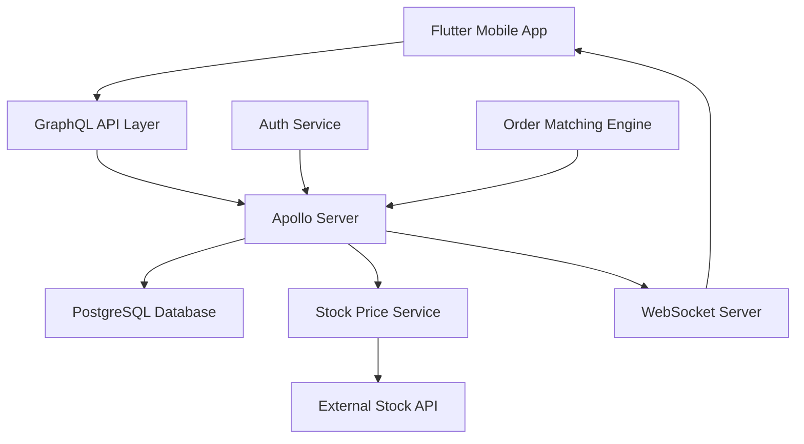

# Paper Trading Stock Application - Project Report

## 1. Introduction/Background

The Paper Trading Stock Application is a comprehensive financial technology solution designed to provide users with a risk-free environment to practice stock trading. This application simulates real-world trading scenarios without involving actual money, making it an ideal platform for beginners to learn trading strategies and experienced traders to test new approaches.

The project is particularly relevant in today's financial landscape where:
- Increasing number of retail investors entering the market
- Growing need for educational tools in financial markets
- Rising demand for risk-free trading practice environments
- Importance of real-time market data and analysis

## 2. Problem Statement/Domain

### Current Market Challenges:
1. High barrier to entry for new traders due to financial risks
2. Lack of comprehensive platforms combining real-time data with paper trading
3. Need for educational tools that simulate real market conditions
4. Complexity in managing multiple trading aspects (portfolio, orders, real-time data)

### Project Objectives:
1. Create a secure and scalable paper trading platform
2. Implement real-time stock price updates and trading functionality
3. Provide comprehensive portfolio management and analysis tools
4. Ensure user-friendly interface for both beginners and experienced traders

## 3. Techniques/Tools/Technologies Used

### Backend Technologies:
- **Node.js & Express**: Server framework
- **Apollo GraphQL**: API layer for efficient data fetching
- **PostgreSQL**: Primary database for data persistence
- **WebSocket**: Real-time data transmission
- **JWT**: Authentication and authorization
- **TypeScript**: Type-safe development

### Frontend Technologies:
- **Flutter**: Cross-platform mobile development
- **Riverpod**: State management
- **GraphQL Client**: Data fetching and caching
- **WebSocket Client**: Real-time updates

### DevOps & Infrastructure:
- **Docker**: Containerization
- **Terraform**: Infrastructure as Code
- **AWS Services**:
  - EC2: Application hosting
  - RDS: Database management
  - ElastiCache: Caching layer
  - S3: Static asset storage
  - CloudWatch: Monitoring and logging

## 4. Block Diagram/Architecture/Methodology

### System Architecture

### Key Components:

1. **Backend Foundation (Completed)**
   - PostgreSQL schema with tables for users, stocks, orders, trades, and portfolios
   - Stock price fetcher service for real-time data
   - GraphQL API with type definitions and resolvers
   - Database connection management

2. **Trading Logic (Completed)**
   - Real-time price updates via WebSocket
   - Order matching engine for market and limit orders
   - Portfolio management and P&L tracking
   - Transaction management with proper error handling

3. **Authentication System (Completed)**
   - JWT-based authentication
   - Secure password hashing
   - Protected routes and operations
   - User session management

4. **Mobile Application (In Progress)**
   - Flutter-based UI implementation
   - GraphQL client integration
   - Real-time data handling
   - State management with Riverpod

### Implementation Methodology:

1. **Database Design**
   - Normalized schema for efficient data storage
   - Proper indexing for performance optimization
   - Transaction management for data integrity

2. **API Layer**
   - GraphQL for flexible data fetching
   - WebSocket for real-time updates
   - Proper error handling and validation

3. **Trading Engine**
   - Event-driven architecture
   - Queue-based order matching
   - Real-time price updates
   - Portfolio rebalancing

4. **Security Measures**
   - JWT token-based authentication
   - Password hashing with bcrypt
   - Input validation and sanitization
   - Rate limiting and request validation

### Current Progress:
- Backend Foundation: ✅ 100% Complete
- Trading Logic: ✅ 100% Complete
- Authentication: ✅ 100% Complete
- Mobile App: 🟡 In Progress
- Deployment: ❌ Not Started

### Next Steps:
1. Complete Flutter mobile application development
2. Set up cloud infrastructure
3. Deploy and test the complete system 
